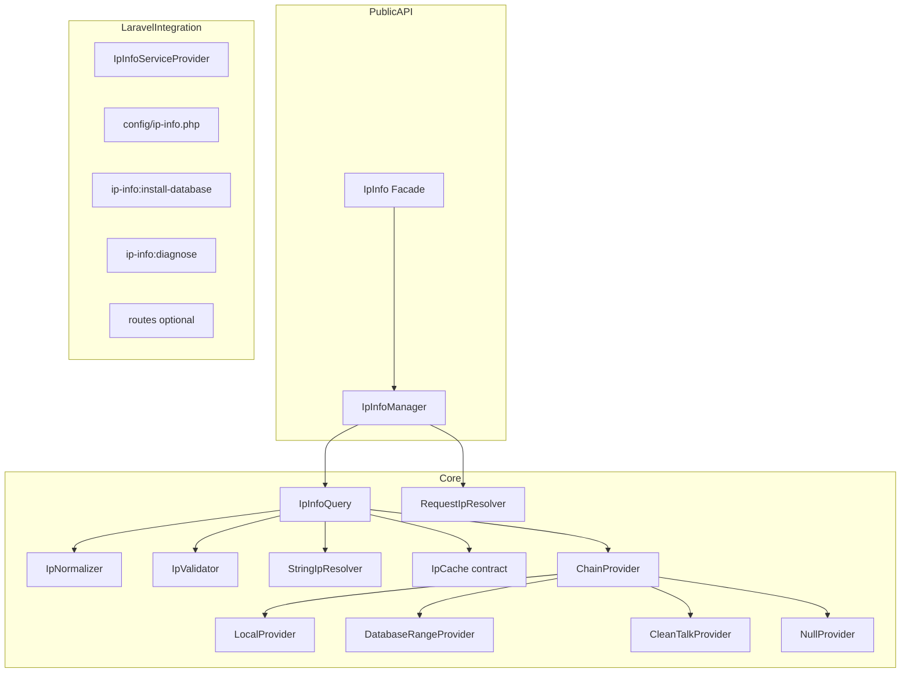

# Refactor Plan — Laravel IP Info

Target: production-ready Laravel package `suprun-bohdan/laravel-ip-info`, namespace `SuprunBohdan\IpInfo`.

See [audit.md](audit.md) for baseline findings.

## 1. Target architecture



Core logic does not depend on HTTP except in `RequestIpResolver` and optional controller.

## 2. Target public API

```php
use SuprunBohdan\IpInfo\Laravel\Facades\IpInfo;

IpInfo::for('8.8.8.8')->countryCode();
IpInfo::for('8.8.8.8')->isPublic();
IpInfo::for('127.0.0.1')->isPrivate();
IpInfo::forRequest($request)->ip();
IpInfo::forRequest($request)->countryCode();
```

Returns `IpInfoResult` value object internally via `->result()`.

Facade resolves container-bound `IpInfoManager` (accessor: `ip-info`).

**Rationale:** Fluent entrypoints hide provider chain and cache; users do not configure `ChainProvider` for basic usage.

## 3. Namespace migration plan

| Current | Target |
|---------|--------|
| `SuprunBohdan\LaravelIpInfo\` | `SuprunBohdan\IpInfo\` |
| `LaravelIpInfoServiceProvider` | `SuprunBohdan\IpInfo\Laravel\IpInfoServiceProvider` |
| Config `laravel-ip-info` | `ip-info` |
| Command `laravel-ip-info:install` | `ip-info:install-database` |
| Publish tag `laravel-ip-info-config` | `ip-info-config` |

Migration steps:

1. Add new `SuprunBohdan\IpInfo` tree under `src/`
2. Update `composer.json` autoload + extra.laravel
3. Delete old `SuprunBohdan` classes
4. Update tests namespace
5. Document breaking changes in CHANGELOG

## 4. Composer/package metadata plan

- **name:** `suprun-bohdan/laravel-ip-info`
- **description:** Laravel package for IP detection, normalization, request IP resolution, geo lookup, caching, and infrastructure-aware IP intelligence.
- **php:** `^8.2`
- **laravel:** `^10.0|^11.0|^12.0` via illuminate/* packages
- Remove `predis/predis` from require; use Laravel cache
- Remove `minimum-stability: dev`
- Add dev: testbench, pint, phpstan
- Scripts: test, analyse, format, format:test, validate

Details: [composer-review.md](composer-review.md).

## 5. Laravel service provider plan

`SuprunBohdan\IpInfo\Laravel\IpInfoServiceProvider`:

**register():**

- Merge config `ip-info`
- Singletons: `IpValidator`, `IpNormalizer`, `StringIpResolver`, `RequestIpResolver`
- Bind `IpCache` → `LaravelCacheIpCache` or `NullIpCache`
- Register providers + `ChainProvider`
- Bind `IpInfoManager`
- `$this->app->alias(IpInfoManager::class, 'ip-info')`

**boot():**

- Publish config tag `ip-info-config`
- Load migrations (database optional feature)
- Register commands when console
- Load routes **only if** `config('ip-info.routes.enabled')`

## 6. Config publishing plan

Default package config: `src/config/ip-info.php`

Published to: `config/ip-info.php`

Sections: `cache`, `providers`, `cleantalk`, `database`, `routes`, `trusted_proxies`

All runtime reads via `config('ip-info.*')` — no direct `env()` outside config file.

## 7. Cache abstraction plan

Contract: `SuprunBohdan\IpInfo\Contracts\IpCache`

Implementations:

- `LaravelCacheIpCache` — uses `Cache::store(config('ip-info.cache.store'))`
- `NullIpCache` — when `cache.enabled = false`

Key format: `{prefix}:v1:{normalized_ip}`

Do not cache failed lookups or private/local/reserved IPs unless explicitly configured later (default: no).

## 8. Provider system plan

Contract: `SuprunBohdan\IpInfo\Contracts\IpProvider`

Method: `lookup(IpAddress $ip): ProviderResult`

| Provider | Role |
|----------|------|
| `LocalProvider` | Classify private/local/reserved; no external call |
| `DatabaseRangeProvider` | IPv4 offline ranges; skip if table missing or disabled |
| `CleanTalkProvider` | Optional HTTP; disabled by default |
| `NullProvider` | Tests / disabled lookup |
| `ChainProvider` | Ordered fallback |

Errors wrapped in `ProviderException` at HTTP boundary; chain continues on recoverable miss.

## 9. Test plan

**Unit:** IpAddress, IpValidator, IpNormalizer, IpRange, cache keys, each provider, chain fallback, exceptions

**Feature (Testbench):** SP loads, config merge, facade resolves, DI, RequestIpResolver spoof test, cache hit/miss, install command with Storage::fake, routes disabled/enabled

Tooling: PHPUnit 10+, Mockery, Orchestra Testbench per Laravel version.

## 10. Static analysis plan

- Laravel Pint (preset laravel)
- PHPStan level 6 with Larastan if compatible, else plain PHPStan on `src/`
- `composer validate --strict` in CI

## 11. CI plan

GitHub Actions workflow:

1. `composer validate --strict`
2. `composer install`
3. `vendor/bin/pint --test`
4. `vendor/bin/phpstan analyse`
5. `vendor/bin/phpunit`

Matrix: PHP 8.2, 8.3 × Laravel 10, 11.

## 12. README rewrite plan

Technical README covering: scope, non-goals, install, PHP/Laravel versions, config, public API, request IP resolution, providers, cache, proxy warning, IPv4/IPv6, private IP behavior, testing, changelog link, license.

No marketing language. Document known limitations honestly.

## 13. Backward compatibility decision

**No backward compatibility.** Clean break release **v1.0.0**.

Breaking:

- Package name and namespace
- Config key/file
- Command names
- Removed Predis direct config
- HTTP route opt-in (was always on)
- Removed timezone fallback
- Replaced `IPCheckService` with `IpInfo` facade/manager

## 14. Release checklist

- [ ] All tests pass locally and in CI
- [ ] PHPStan clean at configured level
- [ ] Pint clean
- [ ] README, CHANGELOG, LICENSE present
- [ ] docs/audit.md, refactor-plan.md, composer-review.md committed
- [ ] No dead code from old namespace
- [ ] Git tag `v1.0.0`
- [ ] GitHub repo renamed to `laravel-ip-info` (manual)
- [ ] Packagist submit `suprun-bohdan/laravel-ip-info` (manual)

## Commit map

1. `docs: add full package audit`
2. `docs: add refactor plan and architecture decisions`
3. `docs: add composer dependency review`
4. `refactor(composer): align package metadata and tooling deps`
5. `feat(core): add IP support layer and value objects`
6. `feat(resolvers): add request IP resolution with proxy safety`
7. `feat(providers): add chain, local, database, and cleantalk providers`
8. `feat(laravel): add service provider, config, commands, optional routes`
9. `test: add unit and testbench feature coverage`
10. `ci: add pint, phpstan, and github actions`
11. `docs: add readme, changelog, and license`
12. `chore: remove legacy code and dead paths`
