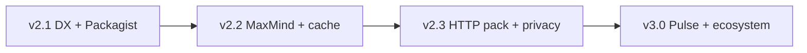

# Product Roadmap v2.1–v3.0 — `suprun-bohdan/laravel-ip-info`

Goal: make the package the default Laravel choice for **secure request IP resolution**, **offline geo**, and **developer-friendly testing** — not a full MaxMind clone.

## Positioning

| Strength | vs typical GeoIP packages |
|----------|---------------------------|
| Opt-in trusted proxy headers | Competitors often trust XFF blindly |
| Private/local/reserved classification | Rare as first-class feature |
| Provider chain + extension events | Flexible, Laravel-native |
| Offline-first option | MaxMind MMDB is the industry standard — adopt, don't reinvent |

**Niche:** Laravel-native IP intelligence with security defaults, offline lookup, and excellent DX.

---

## v2.1 — Developer Experience (P0)

**Target:** `composer require` → working code in 5 minutes.

### Deliverables

| Item | Description |
|------|-------------|
| Packagist publish | `suprun-bohdan/laravel-ip-info` public install |
| Quick Start | README ≤ 30 lines to first `countryCode()` |
| `IpInfo::fake()` | Test doubles without mocking final classes |
| `InteractsWithIpInfo` trait | PHPUnit / Pest helper |
| `ResolveClientIp` middleware | Attach `IpInfoResult` to request attributes |
| `ResolvedClientIpRequest` | Form request with `clientIp()` helper |
| Config presets | `cloudflare`, `nginx_proxy`, `local_only` |
| `ip-info:install` | publish config + migrate + optional DB download |
| `ip-info:install --preset=cloudflare` | One-command Cloudflare setup |
| Scheduled updates | Document + optional `Schedule::command('ip-info:update-database')` |
| Stale DB check | `ip-info:diagnose --json` exit 1 if DB older than N days |

### Acceptance

- New Laravel 11/12 app: install → middleware → test with `IpInfo::fake()` in < 15 minutes.
- CI green on Laravel 10/11/12 matrix.

**Tag:** `v2.1.0`

---

## v2.2 — Performance & MaxMind (P0)

**Target:** production speed and IPv4+IPv6 offline lookup.

### Deliverables

| Item | Description |
|------|-------------|
| `MaxMindProvider` | GeoLite2-Country `.mmdb` reader |
| `ip-info:update-maxmind` | Download/update MMDB with license key |
| Negative cache | Cache `null` country with configurable TTL |
| Batch lookup | `IpInfo::forMany([...])` with single DB pass for ranges |
| Events | `IpLookupStarted`, `IpLookupCompleted`, `IpLookupFailed` |
| Observability | Optional log channel + cache hit/miss counters |
| Benchmarks | CI job with regression guard (cached / MMDB / chain) |

### Performance targets

| Operation | Target |
|-----------|--------|
| Cached lookup | < 1 ms |
| MMDB lookup | < 2 ms |
| Offline CSV IPv4 | < 5 ms |
| HTTP provider | timeout + circuit breaker |

### Acceptance

- IPv6 public address resolves country via MMDB.
- Batch of 100 IPs: measurably fewer queries than 100 sequential lookups.

**Tag:** `v2.2.0`

---

## v2.3 — Product-Ready Geo (P1)

**Target:** useful for SaaS teams beyond raw country code.

### Deliverables

| Item | Description |
|------|-------------|
| Extended `GeoLocation` | Optional `countryName`, `continent`, `isEu` |
| HTTP provider pack | Pluggable drivers: `ipinfo`, `ip-api` (2–3 max) |
| Generic SSRF guard | Host allowlist shared across HTTP providers |
| Rate limit handling | 429 → fall through chain |
| Privacy helpers | `shouldLog()`, `anonymized()` for audit/logging |
| Per-tenant cache | Configurable cache store / prefix per tenant |

### Acceptance

- Switch HTTP driver via config only.
- Private IPs never logged when `privacy.skip_logging` enabled.

**Tag:** `v2.3.0`

---

## v3.0 — Ecosystem & Competitiveness (P2)

**Target:** ecosystem presence and long-term adoption.

### Deliverables

| Item | Description |
|------|-------------|
| Laravel Pulse card | Cache hit rate, errors, top countries |
| Telescope watcher | Opt-in lookup tracing |
| Strict bogon config | Optional aggressive reserved-range filtering |
| Satellite packages | Fraud/VPN detection as separate repos |
| Starter kit | `php artisan ip-info:starter --with-middleware --with-tests` |
| `docs/vs-alternatives.md` | Honest comparison with torann/geoip, stevebauman/location |

**Tag:** `v3.0.0`

---

## Explicit non-goals

- Full geocoder (city lat/lon for all IPs as core scope)
- PageRank, ML, VPN detection in core package
- Timezone → country guessing
- 10+ HTTP providers in core

---

## Priority order (ROI)

1. Packagist + Quick Start + testing fake  
2. Middleware + install presets  
3. MaxMind MMDB provider  
4. Negative cache + batch lookup  
5. HTTP provider pack + privacy helpers  

---

## Quality bar (every release)

- PHPUnit + PHPStan green
- CHANGELOG + migration notes for breaking changes
- Semver strictly enforced
- `docs/migration-guide.md` updated
- Local sandbox `make test-package` before tag

---

## Suggested timeline

| Version | Focus | Estimate |
|---------|-------|----------|
| v2.1.0 | DX, testing, install | 4–6 weeks |
| v2.2.0 | MaxMind, performance | +6 weeks |
| v2.3.0 | Geo DTO, HTTP drivers | +8 weeks |
| v3.0.0 | Pulse, ecosystem | +12 weeks |

---

## Immediate next actions

1. Publish to Packagist + README badges  
2. Implement `IpInfo::fake()` + testing trait (v2.1 spike)  
3. Spike MaxMind reader dependency and license key flow  
4. Add `docs/vs-alternatives.md` draft  
