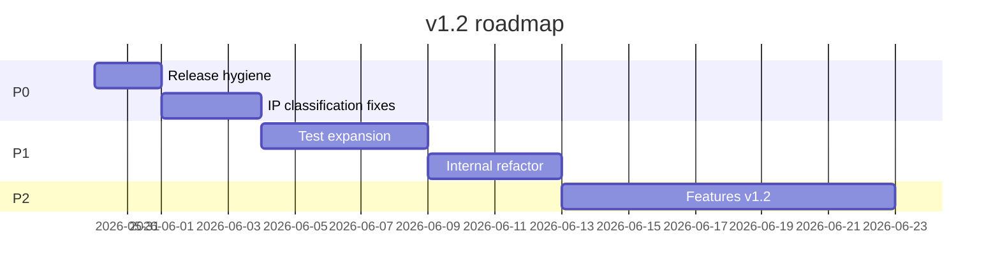

# v1.2 Refactor & Hardening Plan — `suprun-bohdan/laravel-ip-info`

Plan after commit `896dd12` (PHPStan/Pint/PHPUnit fixes, seeder PSR-4).

## Current baseline

| Check | Status |
|-------|--------|
| Pint | PASS |
| PHPStan (512M) | PASS |
| PHPUnit | 24 tests |
| Local Docker sandbox | Local only (`/sandbox/` gitignored) |
| Git tags | `v1.0.0`, `v1.1.0` on older commit |
| Packagist / CI green | Pending |

---

## Wave A — Release hygiene (P0)

**Goal:** Stable public release with verified CI.

1. Push `main` and verify GitHub Actions (Laravel 10/11/12 matrix).
2. Tag `v1.1.1` (patch: tooling + test fixes) or `v1.2.0` if Wave B items ship in same release.
3. Publish/update Packagist package `suprun-bohdan/laravel-ip-info`.
4. Update `CHANGELOG.md` with fixes from `896dd12`.
5. Optional: rename GitHub repo to `laravel-ip-info` and add Packagist alias.

**Acceptance:** Green CI, installable via `composer require suprun-bohdan/laravel-ip-info`, README examples run on Laravel 11/12.

---

## Wave B — IP classification hardening (P0)

**Goal:** Predictable behaviour for edge-case IPs found in sandbox scenarios.

### B1. Documentation / TEST-NET ranges

PHP `FILTER_FLAG_NO_RES_RANGE` does not treat RFC 5737 TEST-NET (`192.0.2.0/24`, `198.51.100.0/24`, `203.0.113.0/24`) as reserved.

- Add explicit CIDR checks in `IpValidator::isReserved()` via existing `IpRange::ipv4InCidr()`.
- Add unit tests for each TEST-NET block.
- Decide policy: `shouldSkipExternalLookup()` = true (recommended for geo packages).

### B2. IPv4-mapped IPv6 consistency

`IpNormalizer` already strips `::ffff:` prefix. Ensure all resolver paths use normalizer before validation (audit `RequestIpResolver`).

- Add integration test: `::ffff:10.0.0.1` → private, skip external lookup.

### B3. IPv6 reserved ranges (scope control)

Currently: ULA (`fc00::/7`) and link-local (`fe80::/10`) only.

- v1.2 minimum: add `::` unspecified, multicast (`ff00::/8`) to skip list.
- v1.3+: optional config flag for stricter Bogon filtering.

**Acceptance:** Sandbox scenario matrix passes without expectation tweaks; new unit tests in `IpValidatorTest`.

---

## Wave C — Test coverage expansion (P1)

**Goal:** Catch regressions without mocking `final` classes.

| Area | Action |
|------|--------|
| `RequestIpResolver` | Feature tests: trusted proxies, `X-Forwarded-For`, `CF-Connecting-IP` |
| `DatabaseRangeProvider` | Test missing table, empty table, range boundaries |
| `CleanTalkProvider` | Mock HTTP; timeout/error → chain fallback |
| `InstallDatabaseCommand` / `UpdateDatabaseCommand` | End-to-end with temp CSV + sqlite |
| `IpInfoBuildingChain` event | Assert custom provider injection |
| Cache | TTL expiry, custom cache store, `forget()` if exposed |

**Pattern:** Prefer stub `IpProvider` implementations over Mockery on `final` managers.

**Acceptance:** PHPUnit ≥ 35 tests; coverage of all public config flags.

---

## Wave D — Internal refactor (P1)

**Goal:** Improve testability and extension points without breaking public API.

### D1. Optional `IpLookupContract` for manager

Extract lookup orchestration behind interface so unit tests can stub without partial mocks. Keep `IpInfoManager` as concrete entry point.

### D2. Config cleanup

- Replace `env()` usage in published config with documented `.env` keys only (already excluded from PHPStan).
- Add `config/ip-info.php` schema comments for every key.

### D3. Seeder & database layer

- Remove dead `src/database/` directory if empty.
- Consider chunked seeder progress output for large CSV.
- Evaluate `ip2long()` vs `IpRange::ipv4ToLong()` consistency (signed int storage).

### D4. Provider result semantics

- Document when `ProviderResult::$resolved` is false vs null `countryCode`.
- Align `ChainProvider` provider name in aggregated failures (`chain` vs last provider).

**Acceptance:** No BC break; deprecations documented in CHANGELOG if any signature changes.

---

## Wave E — Features (P2, v1.2–v1.3)

Pick based on product priority:

1. **IPv6 offline database** — separate table or embedded MMDB reader (larger scope).
2. **Additional geo providers** — pluggable HTTP providers via `providers.custom` + interface.
3. **SSRF hardening** — allowlist hosts, disable redirects in HTTP client for CleanTalk.
4. **Facade DX** — `IpInfo::for($ip)->toArray()` / `JsonSerializable` on `IpInfoResult`.
5. **Artisan `ip-info:diagnose`** — add `--json` output for CI/scripts.

---

## Wave F — Documentation & DX (P2)

1. README: install, config matrix, trusted proxy setup, offline DB workflow.
2. `docs/post-refactor-audit.md` — mark CI/sandbox as verified.
3. Migration guide from legacy `SuprunBohdan\IpInfo` / old config keys (if any consumers exist).
4. Keep Docker sandbox local; document `make init/start/test` in README **Development** section only (not shipped in package).

---

## Suggested release order

| Version | Scope |
|---------|--------|
| **v1.1.1** | Wave A only (tooling patch, already on `main`) |
| **v1.2.0** | Wave B + Wave C |
| **v1.3.0** | Wave E (selected features) |

---

## Out of scope (explicit)

- Full MaxMind / city-level geo
- PageRank, ML, cloud-only dependencies
- Crawler / discovery system (separate project)
- Committing Docker sandbox to git

---

## Immediate next actions (maintainer)

1. `git push origin main`
2. Tag and push `v1.1.1`
3. Implement Wave B1 (TEST-NET) — smallest high-value fix
4. Extend CI or local `make test-package` in sandbox before each tag
